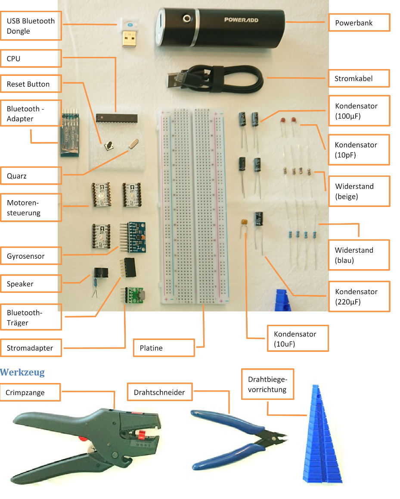
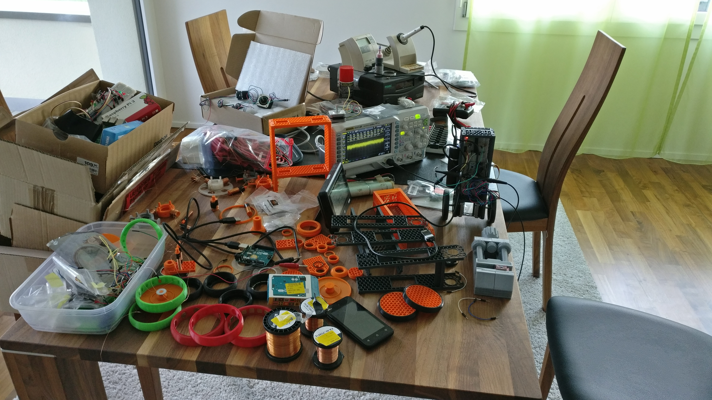
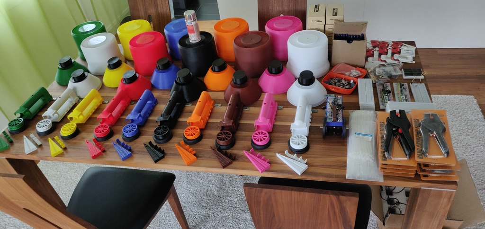
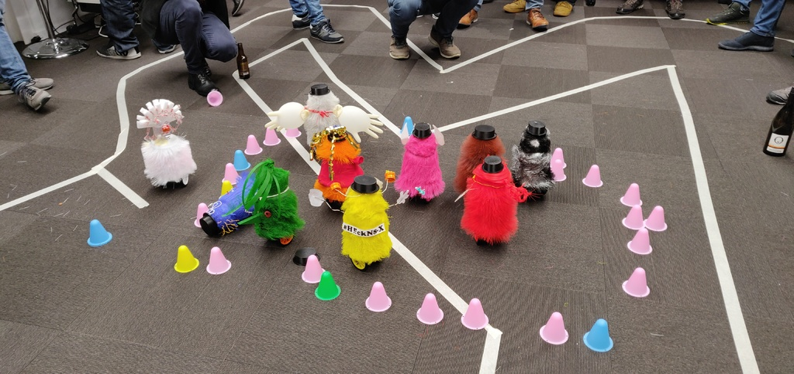
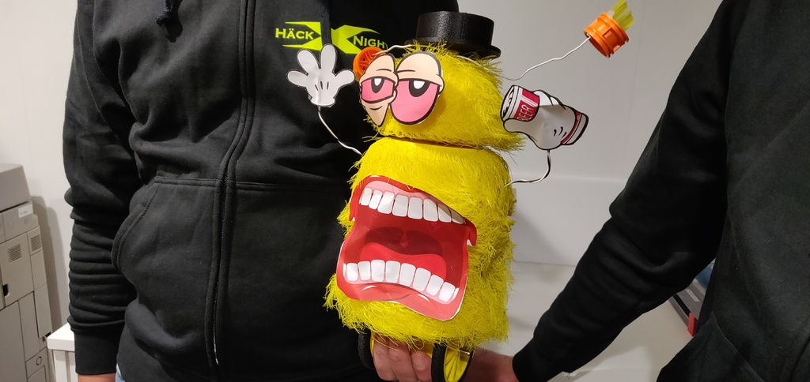
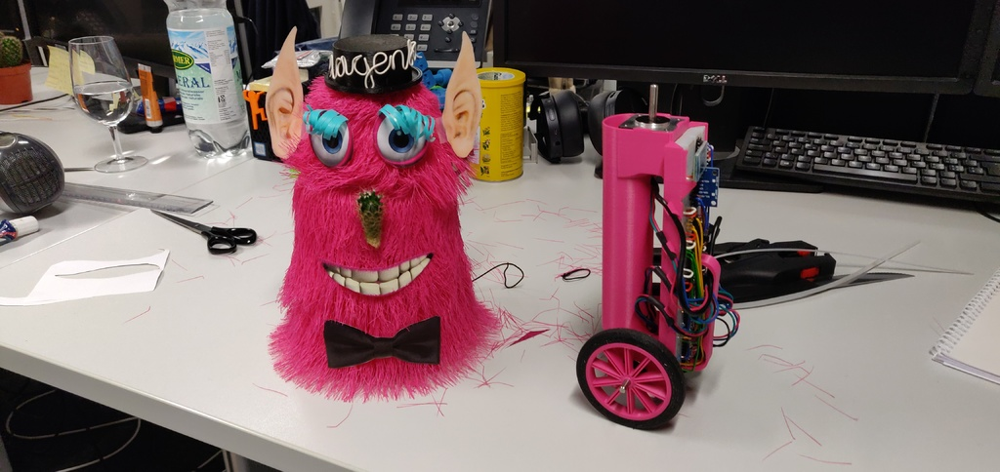
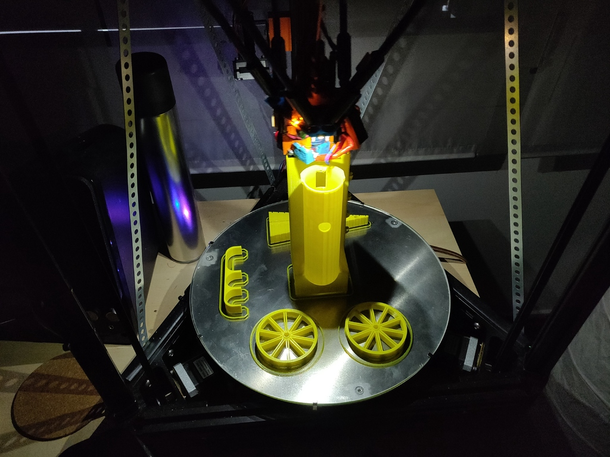

# Balancing-Bot
 A 3d printable balancing bot designed in Fusion360

Just another balancing robot... but with hair! :-)

The bot is using stepper motors, an accelerometer/gyro and a pid loop programmed in Arduino IDE for an AtMega328p. 
The bot can be controlled using a Bluetooth, i recommend the app 'Arduino Bluetooth RC Car' for Android (not tested with IPhone).

The source code and build instructions (german language only at the moment) are included in a PDF: [Build Instruktions](Balancing%20Bot%20instructions.pdf) 

Programming the HC-05 module with these instructions: 
(from https://www.instructables.com/Modify-The-HC-05-Bluetooth-Module-Defaults-Using-A/) 
set serial monitor in arduino ide to 9600 baud and connect 
AT+ORGL 
AT+VERSION? 
AT+NAME=Bot red 
AT+UART=57600,1,0 
AT+POLAR)1,0 

The code is structured this way it is as it was provided incomplete and had to be completed by the teams. Additionally it was my first arduino project (i'm a java programmer)... 

It was designed mostly in Fusion 360 and for the skind/hairs OpenSCAD. 
Fusion 360 couldn't handle the thousands of hairs, however rendering in openscad can take a few hours.

Bill of materials (BOM): 
3x stepper motor 14HS11-1004S (Nema 14 35x25x28mm with low inductance) 
3x stepper driver DRV8834 (this is a low voltage driver that works with 5V) 
1x Powerbank 'Powerad Slim 2' 
1x Bread Board 830 point 
1x Microcontroller ATMega328P-PU (preferably with Arduino Bootloader installed) 
1x HC-05 Bluetooth module 
1x Gyro MPU-9250 
1x 5V Speaker 
1x Micro USB adapter 
1x capacitor 220uF 
4x capacitor 100uF 
1x capacitor 10uF 
2x capacitor 10pF 
4x resistor 1 kOhm 
4x resistor 10 kOhm 
1x Pushbutton 
1x crystal 16 MHz 
(optional) Bluetooth Stick for your computer (upload Arduino sketches directly from arduino ide) 
some breadboard wires or cut and strip wires yourself 

Print Time: About 24 hours 
I used an Kossel XL and a 0.25mm nozzle 

Material: PLA 
The tire have to be printed in a flexible material (i used Ninjaflex), or you can print tires and wheels as one part in PLA.

